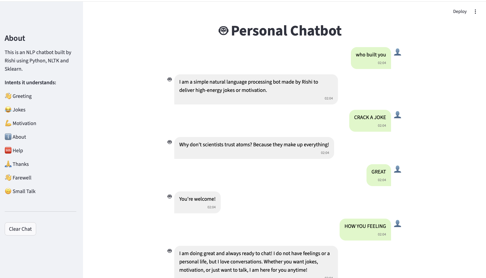

# NLP Intent-Based Chatbot 🤖

A machine learning-powered chatbot built using Python, NLTK, Scikit-learn, and Streamlit. The chatbot uses NLP techniques and TF-IDF vectorization to classify user intents and generate relevant responses.

---

## Demo



---

## Installation

Clone the repository:

```bash
git clone <repository-url>
cd <repository-name>
```

Install dependencies:

```bash
pip install -r requirements.txt
```

or

```bash
pip install nltk scikit-learn streamlit
```

### NLTK Setup (Run Once)

The required NLTK downloads are already included inside `preprocessing.py` but are commented out after the initial setup.

Uncomment and run once if needed:

```python
# nltk.download('punkt')
# nltk.download('punkt_tab')
# nltk.download('stopwords')
```

After the downloads complete successfully, they can remain commented.

---

## Running the Project

### Step 1: Train the Model

```bash
python train.py
```

This will generate:

```text
model.pkl
vectorizer.pkl
```

### Step 2: Launch the Streamlit App

```bash
streamlit run app.py
```

### Alternative: Terminal Mode

The chatbot can also be accessed directly through the terminal:

```bash
python chatbot.py
```

This acts as a backup interface if Streamlit encounters any issues.

---

## Features

- Intent-based chatbot architecture
- Text preprocessing using NLTK
- Tokenization and stemming
- TF-IDF vectorization
- Logistic Regression support
- Support Vector Machine (SVM) support
- Smalltalk conversations
- Joke generation
- Motivation responses
- About and Help commands
- Confidence-based fallback handling
- Streamlit web interface
- Terminal chatbot interface
- Model persistence using Pickle
- Cached model loading using `@st.cache_resource`

---

## Project Structure

```text
├── app.py
├── chatbot.py
├── train.py
├── preprocessing.py
├── intent.json
├── model.pkl
├── vectorizer.pkl
├── requirements.txt
├── demo.png
└── README.md
```

---

## Workflow

```text
User Input
      ↓
Text Preprocessing
      ↓
TF-IDF Vectorization
      ↓
Logistic Regression / SVM
      ↓
Intent Prediction
      ↓
Response Selection
      ↓
Chatbot Reply
```

---

## Text Preprocessing

The preprocessing pipeline performs:

- Lowercasing
- Tokenization
- Noise removal
- Stemming using Porter Stemmer

Example:

```text
Input:
"Tell me a funny joke please"

Output:
["tell", "funni", "joke", "pleas"]
```

---

## Feature Engineering

The chatbot converts text into numerical vectors using TF-IDF.

```python
vectorizer = TfidfVectorizer(
    ngram_range=(1,2)
)
```

This allows the model to learn both individual words and meaningful phrases such as:

```text
good morning
your name
tell joke
help me
```

---

## Machine Learning Models

Two classifiers were implemented and tested.

### Logistic Regression

```python
model = LogisticRegression()
```

### Support Vector Machine (SVM)

```python
model = SVC(kernel="linear", probability=True)
```

The preferred model can be selected in `train.py` by commenting or uncommenting the corresponding code.

---

## Performance Optimization

Initially, the application experienced delays because the model and vectorizer were being loaded repeatedly whenever a user sent a message.

To improve performance, Streamlit's caching mechanism was used:

```python
@st.cache_resource
```

This ensures that:

- The model loads only once
- The vectorizer loads only once
- Response times are significantly faster
- Disk access is reduced
- User experience is smoother

---

## Supported Intents

- Greeting
- Farewell
- Joke
- Motivation
- About
- Help
- Thanks
- Smalltalk
- Fallback

---

## Technologies Used

- Python
- NLTK
- Scikit-learn
- TF-IDF Vectorizer
- Logistic Regression
- Support Vector Machine (SVM)
- Streamlit
- Pickle

---

## Future Improvements

- Spell correction
- Character n-grams
- Larger training dataset
- Context-aware conversations
- Conversation memory
- LLM integration

---

## Author

**Rishi Bansal**

This project demonstrates a complete NLP pipeline including preprocessing, feature extraction, machine learning model training, intent classification, deployment, and optimization using Streamlit.
